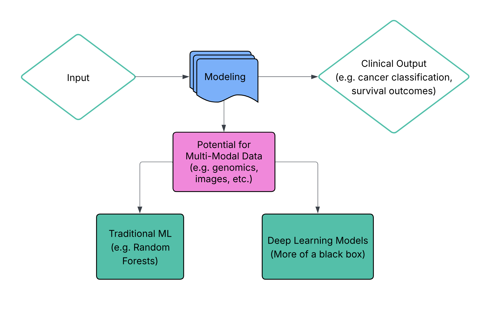

# Cancer Biomarker Discovery


A comprehensive bioinformatics pipeline for discovering cancer biomarkers using RNA-seq data from The Cancer Genome Atlas (TCGA). This project leverages machine learning and statistical methods to identify potential diagnostic and prognostic markers in lung cancer subtypes.

## Contributors

River Zhu, Zoey, Arun, Charlie Yang, Diya, Ana Ferreira (bossanblues@gmail.com), Xinru Zhang, Isha Parikh, Aryan Sharan Guda, Seohyun, Yosen Lin (yosenl@andrew.cmu.edu), Andrew Scouten (yzb2@txstate.edu)

## Table of Contents

- [Getting Started](#getting-started)
- [Architecture](#architecture)
- [Pipeline Overview](#pipeline-overview)
- [Recommended Extensions](#recommended-vscode-extensions)
- [Usage](#usage)
- [AI Disclosure](#ai-disclosure)
- [License](#license)

## Getting Started

### Prerequisites

This project supports two installation methods:

**Option A: Docker (Recommended)**
- Docker Desktop or Docker Engine
- Docker Compose
- VSCode with Dev Containers extension (optional but recommended)

**Option B: Local Installation**
- Python 3.10+
- R 4.0+
- [uv](https://github.com/astral-sh/uv) - Fast Python package installer and resolver
- LLVM 20 (required for umap-learn)

---

### Option A: Docker Installation (Recommended)

Docker provides a consistent development environment and eliminates dependency and compatibility issues.

1. **Install Docker Desktop**:
   - Download from [docker.com](https://www.docker.com/products/docker-desktop/)
   - Or install Docker Engine on Linux

2. **Clone the repository**:
   ```bash
   git clone <repository-url>
   cd Cancer_biomarker_discovery
   ```

3. **Start the environment**:
   ```bash
   # Build and start the container
   docker compose up -d
   ```

4. **Open in VSCode Dev Container** (optional):
   - Install the [Dev Containers extension](https://marketplace.visualstudio.com/items?itemName=ms-vscode-remote.remote-containers)
   - Press `F1` → "Dev Containers: Reopen in Container"
   - VSCode will connect to the container with all extensions and tools configured
   - Jupyter notebooks (`.ipynb` files) will work natively in VSCode without a browser

**Useful Docker Commands**:
```bash
# Stop containers
docker compose down

# Rebuild after dependency changes
docker compose build

# Execute commands in container
docker compose exec dev bash

# Add new Python packages
docker compose exec dev uv add <package-name>

# View running containers
docker compose ps
```

---

### Option B: Local Installation

1. **Install uv** (if not already installed) from [here](https://docs.astral.sh/uv/getting-started/installation/).

2. **Clone the repository**:
   ```bash
   git clone <repository-url>
   cd Cancer_biomarker_discovery
   ```

3. **Install LLVM** (required for some Python packages like umap-learn):

   - **Linux** (Ubuntu/Debian):
     ```bash
     sudo apt-get update
     sudo apt-get install llvm-20
     ```

   - **macOS**:
     ```bash
     brew install llvm@20
     ```

     After installation on macOS, set the required environment variables:
     ```bash
     export CMAKE_PREFIX_PATH=/usr/local/opt/llvm@20
     export LLVM_CONFIG=/usr/local/opt/llvm@20/bin/llvm-config
     ```

   **Note:** LLVM version 20 is required for compatibility with `llvmlite` (a dependency of `numba` and `umap-learn`).

4. **Install Python dependencies**:
   ```bash
   # Install base dependencies
   uv sync

   # Or install with PyTorch extras (for GPU/ML features)
   uv sync --extra pytorch
   ```

5. **Install R dependencies with renv**:
   ```r
   # Install renv if not already installed
   install.packages("renv")

   # Restore R package dependencies
   renv::restore()
   ```

### Recommended VSCode Extensions

For the best development experience, we recommend installing the following VSCode extensions:

- **[Python](https://marketplace.visualstudio.com/items?itemName=ms-python.python)** (`ms-python.python`) - IntelliSense, debugging, and linting for Python
- **[Ruff](https://marketplace.visualstudio.com/items?itemName=charliermarsh.ruff)** (`charliermarsh.ruff`) - Fast Python linter and formatter
- **[autopep8](https://marketplace.visualstudio.com/items?itemName=ms-python.autopep8)** (`ms-python.autopep8`) - Python code formatter following PEP 8 style guide
- **[R](https://marketplace.visualstudio.com/items?itemName=REditorSupport.r)** (`REditorSupport.r`) - R language support with syntax highlighting and code execution
- **[Jupyter](https://marketplace.visualstudio.com/items?itemName=ms-toolsai.jupyter)** (`ms-toolsai.jupyter`) - Interactive Jupyter notebook support
- **[Dev Containers](https://marketplace.visualstudio.com/items?itemName=ms-vscode-remote.remote-containers)** (`ms-vscode-remote.remote-containers`) - For Docker development (if using Docker)

---

## Architecture

### Multi-Container Setup

The project uses Docker Compose to orchestrate multiple services:

- **dev**: Main development environment with Python, R, and Jupyter Lab
- **db** (optional): PostgreSQL database for storing processed data
- **mlflow** (optional): MLflow tracking server for experiment management

Uncomment services in [docker-compose.yml](docker-compose.yml) as needed.

## Pipeline Overview



## Usage

### Running Analysis Notebooks

- **Python notebooks**: Located in [`notebooks/`](notebooks/)
- **R scripts**: Located in [`scripts/data/`](scripts/data/)

Open notebooks in VSCode or Jupyter Lab and execute cells sequentially.

### Data Organization

TCGA data is organized by cancer type:
- `data/GDCdata/TCGA-LUAD/` - Lung Adenocarcinoma
- `data/GDCdata/TCGA-LUSC/` - Lung Squamous Cell Carcinoma
- `data/GDCdata/TCGA-MESO/` - Mesothelioma

## AI Disclosure

Artificial intelligence tools, including large language models (LLMs), were used during the development of this project to support writing, clarify technical concepts, and assist in generating code snippets. These tools served as an aid for idea refinement, debugging, and improving the readability of explanations and documentation. All AI-generated text and code were thoroughly reviewed, verified for correctness, and understood in full before being incorporated into this work. The responsibility for all final decisions, interpretations, and implementations remains solely with the contributors.

## License

This project is licensed under the MIT License - see the [LICENSE](LICENSE) file for details.

## License

This project is licensed under the MIT License - see the [LICENSE](LICENSE) file for details.